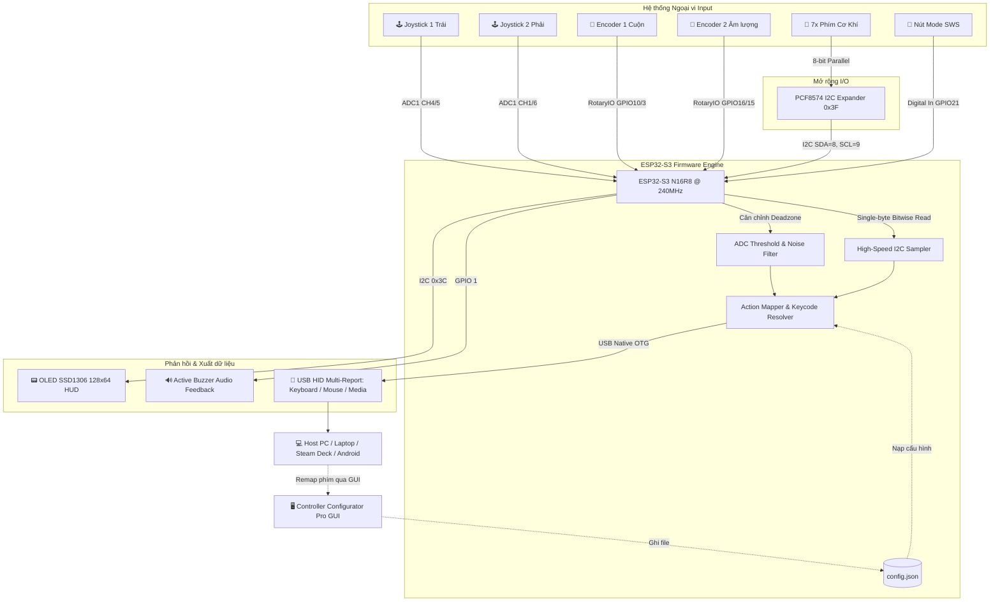

# 🎮 ESP32-S3 Custom USB HID Controller & Configurator Suite
### *High-Performance Multi-Functional Gaming & Macro Controller with Realtime GUI Remapping*

<div align="center">

[](https://www.espressif.com/)
[](https://circuitpython.org/)
[](https://riverbankcomputing.com/software/pyqt/)
[](https://www.usb.org/hid)
[](LICENSE)
[](CONTRIBUTING.md)

<br/>

[**📖 Kiến trúc chi tiết**](docs/ARCHITECTURE.md) • [**🔌 Sơ đồ chân Pinout**](hardware/PINOUT.md) • [**📋 Danh sách linh kiện (BOM)**](hardware/BOM.md) • [**📦 Tải App GUI**](release/README.md) • [**📑 Báo cáo kỹ thuật**](docs/Technical_Report.pdf)

</div>

---

## 🌟 Tổng quan dự án (Project Overview)

**ESP32-S3 Custom USB HID Controller** là một giải pháp phần cứng kết hợp phần mềm mã nguồn mở hoàn chỉnh, biến vi điều khiển **ESP32-S3 (N16R8)** thành một thiết bị điều khiển ngoại vi đa năng chuẩn **USB HID (Human Interface Device)** cắm là nhận (**Plug-and-Play**) mà không cần cài đặt bất kỳ driver nào.

Hệ thống tích hợp đầy đủ:
- **Bộ điều khiển phần cứng đa kênh**: 2 Cần gạt Analog Joystick, 2 Rotary Encoder vô cấp 360°, 7+ nút nhấn cơ khí và màn hình HUD OLED SSD1306 128x64 hiển thị trạng thái thời gian thực.
- **Firmware tối ưu hóa cao**: Xử lý tín hiệu chống rung (Debouncing), bộ lọc Deadzone analog chống trôi điểm không, và cơ chế đọc I2C Bitwise 8-bit siêu tốc không gây nghẽn bus.
- **Phần mềm Desktop Configurator chuyên nghiệp (PyQt6)**: Giao diện Dark Slate hiện đại, mô phỏng bo mạch trực quan, cho phép người dùng tùy biến remap toàn bộ phím và xuất trực tiếp vào USB Mass Storage chỉ trong 1 click.

---

## ✨ Tính năng nổi bật (Key Features)

- ⚡ **Chuẩn Native USB HID 3-in-1**:
  - ⌨️ **Keyboard**: Hỗ trợ đầy đủ bảng chữ cái A-Z, hàng phím số 0-9, F1-F12, phím điều hướng và phím bổ trợ (Ctrl, Shift, Alt, Windows).
  - 🖱️ **Mouse & Scroll**: Điều khiển trỏ chuột, click chuột và cuộn bánh xe vô cấp qua Rotary Encoder.
  - 🔊 **Consumer Control (Multimedia)**: Tăng/giảm âm lượng, Mute, Play/Pause, chuyển bài hát, điều chỉnh độ sáng màn hình.
- 🎯 **Trục Analog Joystick chuyển đổi đa năng**:
  - Thuật toán phân vùng Deadzone chống trôi điểm không, biến 2 cần gạt analog thành 8 phím điều hướng mượt mà hoặc macro phím game.
- 🔄 **Mở rộng I/O I2C qua PCF8574**:
  - Giao tiếp 2 dây (SCL/SDA) điều khiển độc lập 8 nút bấm, tối ưu hóa đọc dữ liệu 1-byte giúp giảm 87.5% thời gian chiếm dụng bus.
- 📟 **Màn hình HUD OLED 0.96 inch SSD1306**:
  - Hiển thị trực quan chế độ hoạt động (ON/STANDBY), trạng thái nút đang nhấn realtime, giá trị encoder và thông tin thiết bị.
- 🔒 **Nút chuyển Mode khẩn cấp (SWS Toggle)**:
  - Khóa/mở tính năng gõ phím tức thì và nhả an toàn toàn bộ phím (`release_all()`) để tránh gõ nhầm khi đang nghỉ.
- 🎛️ **Giao diện Desktop Configurator trực quan**:
  - Xây dựng bằng **PyQt6**, tích hợp đồ họa vector tùy biến vẽ layout bo mạch, lưu cấu hình trực tiếp vào `config.json`.

---

## 📐 Kiến trúc hệ thống (System Architecture)



---

## 🗂️ Cấu trúc thư mục (Repository Structure)

```text
ESP32-S3-Custom-HID-Controller/
│
├── .github/                      # GitHub Actions CI & Issue Templates
│   ├── workflows/lint.yml        # CI Pipeline kiểm tra chất lượng code
│   └── ISSUE_TEMPLATE/           # Mẫu báo lỗi & đề xuất tính năng
│
├── firmware/                     # Mã nguồn Firmware chạy trên ESP32-S3
│   ├── boot.py                   # Khởi tạo USB HID endpoints (Keyboard, Mouse, CC)
│   ├── code.py                   # Vòng lặp điều khiển chính (ADC, I2C, OLED, Actions)
│   ├── config.json               # Profile ánh xạ nút bấm sang phím chức năng
│   ├── font5x8.bin               # Font hiển thị cho màn hình OLED
│   ├── settings.toml.example     # File mẫu cấu hình WiFi/Web API nếu cần
│   └── lib/                      # Các thư viện CircuitPython chuẩn (.mpy)
│       ├── adafruit_hid/         # Thư viện USB HID protocol
│       ├── adafruit_pcf8574.mpy  # Driver điều khiển I/O Expander
│       ├── adafruit_ssd1306.mpy  # Driver điều khiển màn hình OLED I2C
│       └── adafruit_framebuf.mpy # Graphics frame buffer
│
├── configurator-gui/             # Ứng dụng Desktop cấu hình phím (PyQt6)
│   ├── main.py                   # Mã nguồn chính giao diện Configurator Pro
│   ├── requirements.txt          # Danh sách thư viện Python cần cài
│   └── uis/                      # Tài nguyên giao diện QSS, UI, vector designs
│
├── hardware/                     # Tài liệu thiết kế phần cứng
│   ├── schematic/                # Sơ đồ nguyên lý mạch điện (Schematic)
│   │   └── schematic_diagram.png
│   ├── BOM.md                    # Danh mục linh kiện chi tiết
│   └── PINOUT.md                 # Bảng đấu nối dây chi tiết từng chân GPIO
│
├── docs/                         # Tài liệu kỹ thuật & Báo cáo
│   ├── ARCHITECTURE.md           # Phân tích kỹ thuật chuyên sâu
│   ├── Technical_Report.pdf      # Báo cáo kỹ thuật chi tiết của dự án
│   └── images/                   # Hình ảnh minh họa & sơ đồ
│
├── release/                      # Thông tin bản phát hành EXE
│   ├── Controller Configurator Pro.exe
│   └── README.md
│
├── .gitignore                    # Bộ lọc file rác chuẩn cho Python & CircuitPython
├── LICENSE                       # Giấy phép nguồn mở MIT License
├── CONTRIBUTING.md               # Hướng dẫn đóng góp cho cộng đồng
└── README.md                     # Tài liệu chính của Repository
```

---

## 🔌 Sơ đồ nối chân phần cứng (Pinout Quick Reference)

| Module | Tín hiệu | Chân ESP32-S3 | Chức năng |
|:---|:---|:---:|:---|
| **I2C Bus chung** | I2C SCL | **GPIO 9** | Clock cho OLED SSD1306 & PCF8574 |
| | I2C SDA | **GPIO 8** | Data cho OLED SSD1306 & PCF8574 |
| **Joystick 1 (Trái)** | VRx / VRy / SW | **GPIO 6 / 5 / 4** | Trục X, Trục Y (ADC1), Nút nhấn |
| **Joystick 2 (Phải)** | VRx / VRy / SW | **GPIO 7 / 2 / 48** | Trục X, Trục Y (ADC1), Nút nhấn |
| **Encoder 1 (Cuộn/Zoom)**| Phase A / B | **GPIO 10 / 3** | Đọc xung quadrature |
| **Encoder 2 (Âm lượng)**| Phase A / B | **GPIO 16 / 15** | Đọc xung quadrature |
| **Nút bấm PCF8574** | BT1 - BT3 (Vàng) | **P0 - P2 (I2C 0x3F)** | Bố trí cụm tam giác bên trái |
| | BT4 - BT7 (Đỏ) | **P3 - P6 (I2C 0x3F)** | Bố trí cụm hình thoi bên phải |
| **Hệ thống** | Buzzer / Mode SWS | **GPIO 1 / 21** | Âm thanh phản hồi & Khóa/Mở phím |

> 📖 *Xem hướng dẫn đấu nối đầy đủ tại [hardware/PINOUT.md](hardware/PINOUT.md).*

---

## 🚀 Hướng dẫn cài đặt & Triển khai (Getting Started)

### 1. Nạp Firmware cho ESP32-S3
1. Cài đặt **CircuitPython 10.x** dành cho kit `YD-ESP32-S3 (N16R8)` từ [circuitpython.org](https://circuitpython.org/board/yd_esp32_s3_n16r8/).
2. Kết nối bo mạch vào máy tính qua cổng USB Native. Bo mạch sẽ hiển thị dưới dạng ổ đĩa USB `CIRCUITPY`.
3. Sao chép toàn bộ nội dung trong thư mục [`firmware/`](firmware/) vào thư mục gốc của ổ `CIRCUITPY`.
4. Bo mạch sẽ tự khởi động lại và sẵn sàng nhận lệnh!

### 2. Chạy ứng dụng Configurator GUI
```bash
# Di chuyển vào thư mục GUI
cd configurator-gui

# Cài đặt thư viện phụ thuộc
pip install -r requirements.txt

# Khởi chạy giao diện cấu hình
python main.py
```
Hoặc chạy trực tiếp file `Controller Configurator Pro.exe` tại thư mục [`release/`](release/).

---

## 🎮 Quy trình cấu hình phím (Key Remapping Workflow)

```text
[ Mở App GUI ] ---> [ Chọn phím mong muốn cho từng nút ] ---> [ Bấm Xuất cấu hình ] ---> [ Lưu trực tiếp vào ổ CIRCUITPY ] ---> [ XONG! Tay cầm nhận ngay ]
```

---

## 🎯 Góc nhìn Kỹ thuật & Kỹ năng ứng dụng (Technical Showcase for Recruiters)

Dự án này chứng minh năng lực toàn diện trong phát triển hệ thống nhúng và phần mềm ứng dụng:
- **Embedded Systems & Firmware**: Thành thạo kiến trúc ESP32-S3, giao thức truyền thông I2C ở tầng thanh ghi/bitmask, xử lý ADC phi tuyến tính & deadzone calibration, quản lý bộ nhớ PSRAM/Flash.
- **USB Protocol Stack**: Hiểu sâu cơ chế hoạt động của chuẩn USB HID (Report Descriptors, Endpoint Enumeration, Keyboard/Mouse/Consumer Multi-reports).
- **Hardware Integration & Signal Integrity**: Phối hợp đa dạng cảm biến analog, encoder góc quay, bus I/O expander, chống nhiễu phím (Debouncing) và phản hồi âm học/thị giác.
- **GUI Application Development**: Kỹ năng xây dựng ứng dụng Desktop hiện đại bằng Python PyQt6, custom widget drawing bằng `QPainter`, đóng gói ứng dụng độc lập với PyInstaller.

---

## 📄 Giấy phép (License)
Dự án được phân phối dưới giấy phép **MIT License**. Xem chi tiết tại [LICENSE](LICENSE).

---

<div align="center">
⭐ Hãy tặng 1 sao (Star) nếu dự án này hữu ích với bạn! ⭐
</div>
